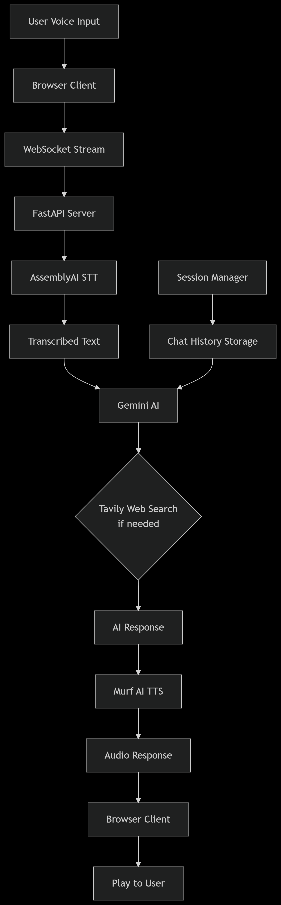

# 🎙️ Murf AI Voice Agent Challenge

Welcome to my journey through the **Murf AI Voice Agent 30-Day Challenge**!
I'm building a smart and interactive **voice agent** using Murf AI's powerful TTS capabilities and integrating it with real-time tech like **AssemblyAI, FastAPI, LLM APIs, and WebSockets**.

---

## 🚀 Overview

This project is a complete voice agent system that enables natural voice conversations with AI. The system features:

- **Real-time audio streaming** via WebSockets
- **Speech-to-text transcription** using AssemblyAI
- **AI-powered responses** via Google Gemini API
- **Text-to-speech conversion** using Murf AI
- **Session-based chat memory** for contextual conversations
- **Web search capabilities** using Tavily API
- **Streaming responses** for natural conversation flow

---

## 📋 System Architecture



_Diagram showing the complete voice agent workflow from user input to AI response_

---

## 📁 Project Structure

```
Voice-Agent/
├── Agent/
│   ├── Routes/
│   │   └── transcriber.py
│   ├── Services/
│   │   ├── Badmosh.py
│   │   └── Gemini_service.py
│   ├── utils/
│   │   └── logging.py
│   ├── index.html
│   ├── main.py
│   ├── script.js
│   └── style.css
├── .env
├── .gitignore
├── README.md
├── requirements.txt
└── flow.png
```

---

## 🗓️ Challenge Progress (Day 1-30)

### 🗓️ Day 1-3: Foundation

- Set up FastAPI backend with Murf AI TTS integration
- Built basic UI with text input and audio playback
- Polished UX for natural voice interactions

### 🗓️ Day 4-7: Echo Bot & Transcription

- Added microphone recording with MediaRecorder API
- Implemented audio upload to server
- Integrated AssemblyAI for speech-to-text
- Created voice-to-voice echo pipeline

### 🗓️ Day 8-12: AI Conversation & Memory

- Integrated Google Gemini API for AI responses
- Built audio-to-AI conversation pipeline
- Added session-based chat memory
- Implemented robust error handling
- Revamped UI for better user experience

### 🗓️ Day 13-15: Project Structure & WebSockets

- Organized codebase with proper folder structure
- Created helper functions and services
- Implemented WebSocket endpoint for real-time communication

### 🗓️ Day 16-17: Real-time Audio Streaming

- Built client-side audio streaming to server via WebSockets
- Integrated AssemblyAI's Streaming API for real-time transcription
- Implemented turn detection for natural conversation flow

### 🗓️ Day 18-30: Advanced Features & Polish

- Added Tavily web search integration
- Implemented streaming responses for natural conversation
- Enhanced error handling and user feedback
- Optimized performance and reliability
- Added comprehensive documentation

---

## ⚙️ Installation & Setup

### Prerequisites

- Python 3.8+
- API keys for:
  - Murf AI
  - AssemblyAI
  - Google Gemini
  - Tavily (optional)

### 1. Clone the Repository

```bash
git clone https://github.com/Vishalpandey1799/Murf-AI-Voice-Agent.git
cd Murf-AI-Voice-Agent
```

### 2. Set Up Virtual Environment

```bash
# Windows
python -m venv .venv
.venv\Scripts\activate

# Mac/Linux
python3 -m venv .venv
source .venv/bin/activate
```

### 3. Install Dependencies

```bash
pip install -r requirements.txt
```

### 4. Configure Environment Variables

Create a `.env` file in the root directory:

```env
MURF_API_KEY=your_murf_api_key_here
ASSEMBLY_API_KEY=your_assemblyai_api_key_here
GEMINI_API_KEY=your_gemini_api_key_here
TAVILY_API_KEY=your_tavily_api_key_here (optional)
```

### 5. Run the Application

```bash
uvicorn main:app --reload
```

Open your browser and navigate to `http://localhost:8000`

---

## 🎯 Usage

1. **Start a Conversation**: Click the microphone button to start speaking
2. **Real-time Transcription**: Watch as your speech is transcribed in real-time
3. **AI Processing**: The system processes your query using Gemini AI
4. **Voice Response**: Listen to the AI's response generated with Murf AI
5. **Continuous Conversation**: The system maintains context throughout the conversation

### Advanced Features:

- **Web Search**: Enable web search for queries requiring current information
- **Session Management**: Conversations are maintained with session-based memory
- **Streaming Responses**: Responses are streamed for natural conversation flow

---

## 🔧 API Endpoints

 
- `POST /agent/chat/{session_id}` - Session-based chat
- `GET /ws` - WebSocket for real-time streaming

---

## 🛠️ Technologies Used

- **Backend**: FastAPI, Python
- **Frontend**: HTML, CSS, JavaScript
- **APIs**: Murf AI, AssemblyAI, Google Gemini, Tavily
- **Real-time**: WebSockets, MediaRecorder API
- **Audio Processing**: Wave, pydub

---

## 🙌 Acknowledgments

Special thanks to:

- **Murf AI** for organizing this challenge and providing excellent TTS capabilities
- **AssemblyAI** for accurate speech-to-text transcription
- **Google Gemini** for powerful AI conversation capabilities
- **Tavily** for web search functionality

---

## 🔗 Connect & Follow

Follow my progress on LinkedIn with the hashtag [#30DayVoiceAgent](https://www.linkedin.com/in/vishal-kumar-3835a9330/)

Let's build the future of voice interfaces together! 🚀

---

_This project was developed as part of the Murf AI Voice Agent 30-Day Challenge_
