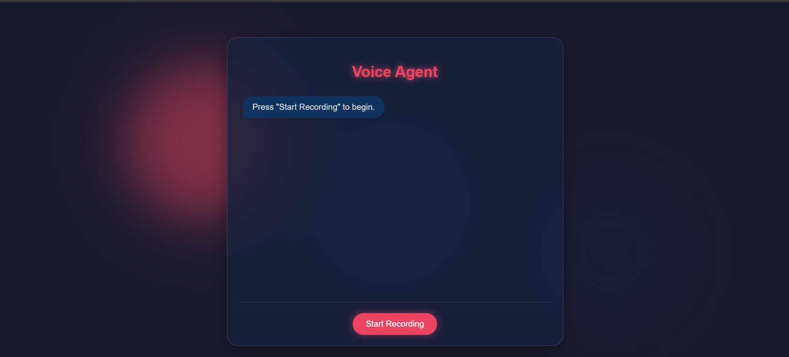

# 🎙️ Murf AI Voice Agent Challenge

Welcome to my journey through the **Murf AI Voice Agent 30-Day Challenge**!
I'm building a smart and interactive **voice agent** using Murf AI's powerful TTS capabilities and integrating it with real-time tech like **AssemblyAI, FastAPI**, and **LLM APIs**.

---

### 🗓️ Day 1 – Kickoff & Setup

- 🚀 Joined the **Murf AI Voice Agent Challenge**
- 🧠 Explored the challenge format, goals, and tools
- 💻 Set up the base project using **FastAPI**
- 🔐 Registered and tested the **Murf API key**
- 🎉 Successfully generated my **first TTS audio** with Murf AI

---

### 🗓️ Day 2 – TTS API Integration

- 🔁 Connected **Murf's TTS API** to FastAPI backend
- 🧪 Built a basic UI with text input and audio playback
- 🎧 Achieved full **text-to-speech cycle** in browser
- 🛠️ Handled errors gracefully on both front and back end
- 📢 Shared my progress on LinkedIn with `#30DayVoiceAgent`

---

### 🗓️ Day 3 – Voice Agent UX

- 🖌️ Polished the UI with improved design (HTML/CSS)
- 🔄 Refactored API flow for smoother UX
- 💡 Learned how to make the voice interaction feel more natural
- 🙌 Thanked **Murf AI** publicly for enabling student creativity

---

### 🗓️ Day 4 – Echo Bot 🎤

- 🪞 Added a brand-new feature: **Echo Bot** section in the UI
- 🧩 Used the browser’s **MediaRecorder API** to:

  - Start and stop mic recordings
  - Instantly play back recorded audio

- 🧠 Learned how to work with real-time audio in the browser
- ✨ This will serve as the foundation for future **speech input** integration

---

### 🗓️ Day 5 – Audio Upload + Server Integration ☁️

- ⏺️ Extended the Echo Bot to **upload audio to my Python server**
- 🛠️ Built a new `/upload` API in **FastAPI** to:

  - Accept audio blob from frontend
  - Save it in an `/uploads` folder
  - Return file **name**, **type**, and **size**

- 🔔 Added a real-time **status message on UI** after upload
- 🔃 Improved end-to-end interactivity from mic → server → playback
- 🔥 Feels like I’m building the foundation for a real voice assistant!

---

### 🗓️ Day 6 – Transcription Integration ✍️

- 🧵 Created a new endpoint `/transcribe/file` on the FastAPI backend
- 📤 This endpoint accepts an uploaded audio file and returns its **transcription**
- 🖥️ Integrated the new transcription API into the frontend
- 📜 Displayed the **transcribed text** dynamically in the UI after recording upload
- 🧠 Now I have full flow: **record voice → upload audio → transcribe → display text**
- 🚀 This brings the project one step closer to **real voice-based interaction**

---

### 🗓️ Day 7 – Voice-to-Voice with /tts/echo Endpoint 🎤🔄🎙️

- 🆕 Created a new backend endpoint **`/tts/echo`** in FastAPI
- 🎙️ This endpoint:
  1. Accepts an **audio file** from the client
  2. Uses **AssemblyAI** to transcribe the speech to text
  3. Sends the transcription to **Murf AI** to generate **a new voice**
  4. Saves the generated voice file and returns its **URL** to the client
- 🎧 On the client side:
  - After recording stops, the recorded audio is sent to `/tts/echo`
  - The returned **Murf voice URL** is set as the `<audio>` source
  - The new voice plays automatically
- 🔄 Now we have a **full voice-to-voice pipeline**:

  **User speaks → Server transcribes → Murf re-voices → Client plays**

- 🚀 This makes the Echo Bot truly interactive and feels like talking to a real AI agent

---

# 🚀 Day 8 — Building LLM Query Endpoint with FastAPI

## 📅 Overview

On **Day 8** of my Generative AI learning journey, I focused on creating a new FastAPI endpoint that accepts text input, queries an LLM (Google Gemini API), and returns an AI-generated response in JSON format.  
This marks a key step towards integrating AI into APIs for use in chatbots, voice assistants, and other applications.

---

## 🛠 Features Implemented

- **POST `/llm/query` endpoint**:

  - Accepts a JSON payload containing a `text` field.
  - Passes the input to an LLM (Google Gemini API).
  - Returns the AI's response in JSON format.

- **LLM Integration**:

  - Used Google’s **`gemini-1.5-flash`** model for fast response generation.
  - Implemented error handling for model name mismatches and API issues.

- **Code Modularization**:
  - Created a `getResponseFromGemini()` helper function for cleaner code.
  - Isolated API logic from route handling.

---

# 🎙️ Day 9 /llm/query — Audio-to-Audio AI Endpoint

## Overview

The `/llm/query` endpoint accepts **audio recordings** from the client, transcribes them into text, generates a response using an **LLM API**, converts that response into speech with **Murf.ai**, and returns the audio file to be played in the browser.

## Flow

1. **Frontend:**

   - User clicks "Start Recording" → audio captured via `MediaRecorder`.
   - On "Stop Recording" → send audio file to `/llm/query`.

2. **Backend:**

   - Receive audio as `multipart/form-data`.
   - Send to **AssemblyAI** for transcription.
   - Pass transcription text to **GEMINI** for response generation.
   - Send LLM response text to **Murf** for TTS.
   - Return generated audio file to client.

3. **Frontend Playback:**
   - Receive audio_url from server.
   - Create `audio` element and set `src` to blob URL.
   - Play the response instantly.

---

# 🎙Day 10

## 📌 Overview

Today’s milestone: implementing **session-based chat history** so the AI assistant remembers previous conversation turns in the same session.

With this update, the assistant now maintains context between messages, resulting in more natural, relevant, and human-like responses.

---

## 🛠 Tech Stack

- **Backend**: FastAPI (Python)
- **Speech-to-Text**: [AssemblyAI](https://www.assemblyai.com/)
- **LLM**: Google Gemini API
- **Text-to-Speech**: [Murf AI](https://murf.ai/)
- **Frontend**: HTML, CSS, Vanilla JavaScript

---

## 🚀 Features Implemented Today

- **Session Memory** – Stores conversations in an in-memory dictionary keyed by `session_id`.
- **New API Endpoint** – `POST /agent/chat/{session_id}`:
  1. Accepts audio file from the browser.
  2. Transcribes speech with AssemblyAI.
  3. Appends the user message to the session’s chat history.
  4. Sends the full history to Gemini for context-aware replies.
  5. Saves the assistant’s reply back to the history.
  6. Converts the reply to speech with Murf AI.
- **Frontend Update**:
  - Persists `session_id` in the URL query parameter.
  - Automatically starts recording after the AI finishes speaking for hands-free conversations.

---

---

## Day11

-- Error handling

---

# day 12 Conversational Agent — Revamped UI 🎙️

A sleek, minimal, and interactive conversational agent UI for real-time voice-based communication.

## 🚀 Features

- **One-Tap Recording**: Combined "Start Recording" and "Stop Recording" into a single smart toggle button.
- **Automatic Audio Playback**: Audio plays automatically once it’s loaded — no need for a player.
- **Clean Interface**: Removed extra sections like initial TTS and echo bot content.
- **Animated Record Button**: Added visual feedback with animation for better UX.
- **Responsive Design**: Works seamlessly on desktop and mobile.

## 📸 UI Preview

---

## ⚙️ What You’ll Need to Build This (So Far)

To build your own voice agent or Echo Bot like this, you’ll need:

- ✅ **FastAPI** – For serving APIs
- ✅ **Murf AI account** – To get your TTS API key
- ✅ **AssemblyAI / other transcription API** – For speech-to-text
- ✅ **Browser with MediaRecorder API support** – Chrome, Firefox, etc.
- ✅ **Basic frontend setup** – HTML, CSS, JS
- ✅ **Python + pip** – For installing FastAPI and other packages
- ✅ **.env file** – To store your Murf API Key securely
- ✅ **VS Code + Live Server extension** _(optional)_ – For quick frontend preview

---

## 💡 Tools I'm Using

| Tool             | Purpose                             |
| ---------------- | ----------------------------------- |
| Murf AI          | Text-to-Speech (TTS)                |
| FastAPI          | Backend API server                  |
| HTML/CSS/JS      | UI for interaction and playback     |
| MediaRecorder    | Echo Bot mic capture + playback     |
| FormData         | Uploading audio blob to the backend |
| AssemblyAI / STT | Transcribing recorded audio         |

---

## 🙌 Special Thanks

Huge thanks to **Murf AI** for organizing this amazing challenge and encouraging builders to explore the world of voice-first interfaces.
Your tools are enabling the next generation of interactive agents 💜

---

## 🔗 Follow My Progress

📍 Catch my updates on LinkedIn with: [#30DayVoiceAgent](https://www.linkedin.com/in/vishal-kumar-3835a9330/)
Let’s build cool voice stuff together!

---

## 30 Days of AI Voice Agents | Day 10: Chat History @everyone @here

Today, you will be building a chat history feature so that the LLM remembers the previous messages in the conversation.

The chat history will be stored in a datastore. You are free to use any prototype-friendly datastore you want. You can even use a simple in-memory dictionary that is a global variable in the python server, just make sure to run only one FastAPI worker process.

Create a new endpoint POST /agent/chat/{session_id} that will accept audio as input. The session id will be used to store the chat history in the datastore. When the user sends a new message, previous messages in the session are fetched and combined with the new message to be sent to the LLM API. The response from the LLM API is then stored in the chat history and returned to the user.

POST /agent/chat/{session_id} follows the same pattern as POST /llm/query on Day 9, with the addition of chat history (User query in audio -> STT -> append transcript to chat history -> LLM -> add response to chat history -> TTS -> Audio Output)

Update the UI to store the session id as a query param in the URL, and also to start recording the user's voice right after an LLM response is played through to the end.

You should have a complete working conversational bot by the end of this task.

Have a brief conversation with your conversational bot and post the video on LinkedIn.

**Instructions:**

📌 Complete the task, and post on LinkedIn BEFORE 10 AM IST tomorrow.

📌 Submit here after you are done: https://forms.gle/Vqkt7QguEcHybh7RA
